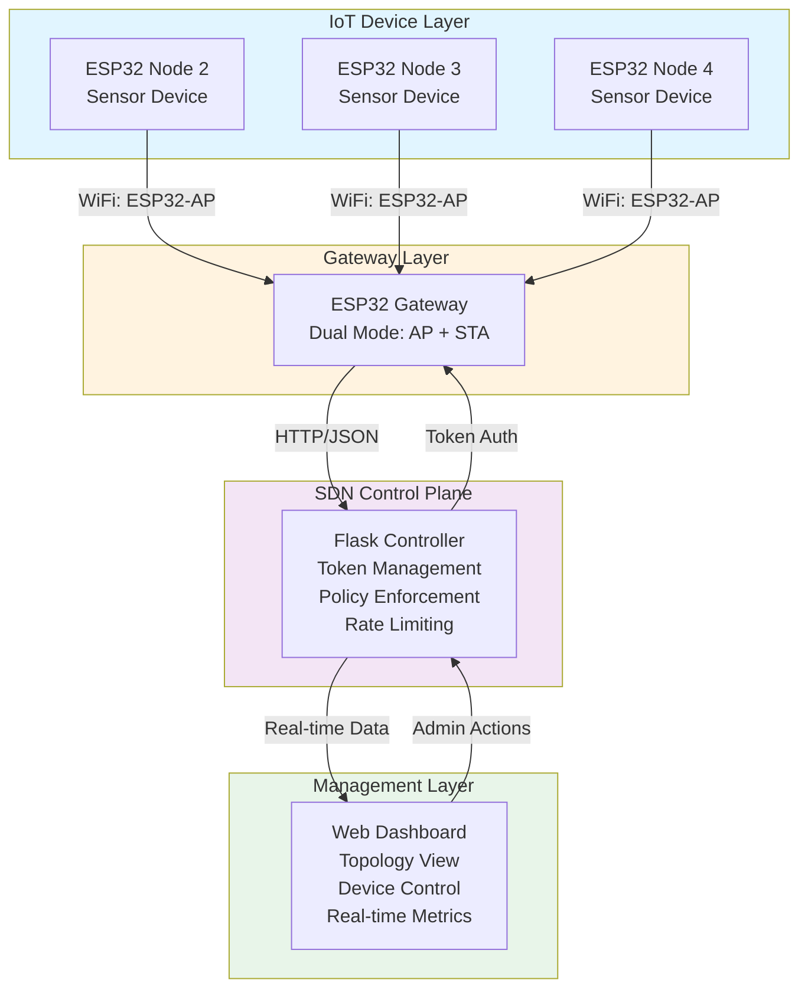

# 🔐 SecureIoT-SDN - Advanced IoT Security Framework with SDN

[](https://www.python.org/downloads/)
[](https://flask.palletsprojects.com/)
[](https://www.espressif.com/en/products/socs/esp32)
[](https://opensource.org/licenses/MIT)
[](https://github.com/KAXUN01/IOT-project)
[](https://github.com/KAXUN01/IOT-project)

## 📖 Overview

**SecureIoT-SDN** is a comprehensive IoT security framework that combines Software-Defined Networking (SDN) with Zero Trust principles to provide enterprise-grade protection for IoT devices. Built using ESP32 microcontrollers, Flask web framework, and Python, SecureIoT-SDN implements advanced security mechanisms including token-based device authentication, automatic session timeouts, rate limiting, real-time device authorization revocation, and dynamic SDN policy enforcement. The framework features an advanced real-time dashboard with network topology visualization, enabling administrators to monitor, control, and secure IoT devices effectively in distributed environments.

## 🆕 Latest Features

### Policy Translation & Enforcement
- **Automatic Policy Translation**: High-level policies from Identity module are automatically translated to granular OpenFlow rules for least-privilege enforcement
- **Dynamic Rule Installation**: OpenFlow rules are dynamically installed based on threat alerts and trust scores
- **Traffic Orchestration**: Intelligent policy decisions based on device identity, trust scores, and threat intelligence

### Threat Detection & Response
- **Analyst Module Integration**: Real-time threat alerts from heuristic analyst trigger automatic policy enforcement
- **Traffic Redirection**: Suspicious traffic is transparently redirected to honeypot for analysis
- **Mitigation Actions**: Automatic mitigation rules generated from threat intelligence

### Heuristic-Based Anomaly Detection with Honeypot Integration
- **Periodic Flow Statistics Polling**: Continuously polls flow statistics from network switches using Ryu (every 10 seconds)
- **Real-Time Anomaly Detection**: Compares real-time traffic metrics against normal baseline profiles to detect DoS attacks, network scans, and volume attacks
- **Automatic Alert Generation**: Sends alerts to Policy Engine when anomalies are detected (DoS, scanning, port scanning)
- **Traffic Redirection to Honeypot**: Automatically redirects suspicious traffic to containerized honeypots for threat intelligence gathering
- **Threat Intelligence Extraction**: Parses honeypot logs to extract actionable intelligence (attacker IPs, commands used, attack patterns)
- **Permanent Mitigation Rules**: Generates and applies confirmed mitigation rules to Policy Engine for permanent threat blocking
- **Integrated Feedback Loop**: Tight integration between lightweight anomaly detection and active deception environment creates adaptive defense system

### Raspberry Pi Deployment
- **Automated Setup Script**: One-command setup for Raspberry Pi deployment
- **Systemd Services**: Production-ready service configuration for SDN controller and framework
- **Complete Integration**: All components configured and ready to run

---

## 🏗️ Architecture Diagram



**Data Flow:**
1. 🔹 ESP32 nodes connect to Gateway via WiFi AP
2. 🔹 Nodes request authentication tokens from Controller via Gateway
3. 🔹 Controller validates devices and issues time-limited tokens
4. 🔹 Nodes send sensor data with tokens to Controller through Gateway
5. 🔹 Controller enforces SDN policies (rate limiting, session timeout, access control)
6. 🔹 Dashboard displays real-time topology, metrics, and allows admin control

---

## ✨ Features

- 🔐 **Token-Based Authentication**: Secure device authentication using dynamically generated unique tokens
- ⏱️ **Session Timeout Management**: Automatic 5-minute session expiry with token invalidation
- 🚦 **Rate Limiting**: Per-device packet rate control (60 packets/minute) to prevent DoS attacks
- 🔄 **Real-Time Authorization Revocation**: Instant device access revocation via dashboard
- 📊 **SDN Policy Enforcement**: Dynamic policies including packet inspection, traffic shaping, and routing
- 🗺️ **Network Topology Visualization**: Interactive topology graph using vis-network.js
- 📈 **Live Metrics Dashboard**: Real-time packet counts, device status, and health metrics
- 🎯 **Anomaly Detection**: Heuristic-based anomaly detection with real-time flow statistics analysis
- 🔄 **Heuristic-Deception Feedback Loop**: Integrated system where anomaly detection triggers honeypot redirection, which generates threat intelligence for permanent mitigation
- 🐝 **Containerized Honeypots**: Docker-based lightweight honeypots (Cowrie) for emulating vulnerable IoT services
- 📊 **Flow Statistics Analysis**: Periodic polling of network switch flow statistics for baseline comparison
- 🚨 **Real-Time Threat Intelligence**: Automatic extraction of attacker IPs, commands, and attack patterns from honeypot logs
- 📝 **Policy Audit Logs**: Comprehensive logging of all policy changes and enforcement actions
- 🌐 **Gateway Architecture**: ESP32 dual-mode gateway (AP + STA) for flexible deployment
- 🔍 **MAC Address Tracking**: Device identification and tracking via MAC addresses
- ⚡ **Control Plane Monitoring**: SDN metrics including latency, throughput, and policy enforcement rate

---

## 🛠️ Tech Stack

### Backend
- 🐍 **Python 3.8+**: Core application logic
- 🌶️ **Flask 2.0+**: Web framework for controller and dashboard
- 📊 **Matplotlib 3.5+**: Data visualization and graph generation

### Frontend
- 🎨 **HTML5/CSS3**: Dashboard UI with gradient styling
- 📡 **JavaScript**: Real-time data updates via AJAX
- 🕸️ **vis-network.js**: Network topology visualization

### IoT Hardware
- 🔧 **ESP32**: WiFi-enabled microcontroller for nodes and gateway
- ⚙️ **Arduino IDE**: ESP32 firmware development
- 📶 **WiFi (802.11)**: Wireless communication protocol

### Libraries & Frameworks
- 🔢 **ArduinoJson**: JSON parsing on ESP32
- 🌐 **HTTPClient**: HTTP requests from ESP32
- 🔄 **uuid**: Token generation
- 📅 **datetime**: Timestamp management

---

## 📦 Installation

### Prerequisites

- Python 3.8 or higher
- pip package manager
- Arduino IDE (for ESP32 programming)
- ESP32 development boards (1 gateway + multiple nodes)

### Controller Setup

1. **Clone the repository**
   ```bash
   git clone https://github.com/KAXUN01/IOT-project.git
   cd IOT-project
   ```

2. **Install Python dependencies**
   ```bash
   pip install -r requirements.txt
   ```

3. **Run the Flask controller**
   ```bash
   python controller.py
   ```
   The controller will start on `http://0.0.0.0:5000`

### ESP32 Gateway Setup

1. **Open Arduino IDE** and install ESP32 board support
2. **Install required libraries**:
   - WiFi (built-in)
   - HTTPClient (built-in)
   - ArduinoJson

3. **Configure Gateway** (`esp32/gateway.ino`):
   ```cpp
   const char *ap_ssid = "ESP32-AP";
   const char *ap_password = "12345678";
   const char *sta_ssid = "YourWiFi";        // Your WiFi network
   const char *sta_password = "YourPassword";
   const char *controller_ip = "192.168.1.100"; // Your laptop/server IP
   ```

4. **Upload** to ESP32 Gateway board

### ESP32 Node Setup

1. **Configure Node** (`esp32/node.ino`):
   ```cpp
   const char *ssid = "ESP32-AP";
   const char *password = "12345678";
   const char *controller_ip = "192.168.4.1";
   String device_id = "ESP32_2";  // Change for each node: ESP32_2, ESP32_3, ESP32_4
   ```

2. **Upload** to each ESP32 Node board (update `device_id` for each node)

---

## 🚀 Usage

### Starting the System

1. **Start the Controller**:
   ```bash
   python controller.py
   ```

2. **Power on ESP32 Gateway**: It will create AP "ESP32-AP" and connect to your WiFi

3. **Power on ESP32 Nodes**: They will:
   - Connect to Gateway AP
   - Request authentication tokens
   - Start sending sensor data every 5 seconds

### Accessing the Dashboard

Open your web browser and navigate to:
```
http://localhost:5000
```

or (from network):
```
http://<controller-ip>:5000
```

### Dashboard Features

*Real-time device monitoring and control interface*

**Device Overview Table**:
- View all connected devices
- Check authorization status
- Monitor packet counts
- See rate limit status
- Authorize/Revoke devices instantly

*Interactive network topology with MAC addresses*

**Network Topology**:
- Visual representation of device connections
- Gateway-centric topology view
- Real-time connection status
- MAC address identification

*Dynamic SDN policy management*

**SDN Policy Controls**:
- Enable/Disable packet inspection
- Toggle traffic shaping
- Configure dynamic routing
- View policy enforcement logs
- Monitor control plane metrics

### Device Data Flow

1. **Token Request**:
   ```json
   POST /get_token
   {"device_id": "ESP32_2", "mac_address": "AA:BB:CC:DD:EE:FF"}
   ```

2. **Data Submission**:
   ```json
   POST /data
   {
     "device_id": "ESP32_2",
     "token": "unique-token-here",
     "timestamp": "1234567890",
     "data": "25.5"
   }
   ```

3. **Response**: 
   - `{"status": "accepted"}` - Data accepted
   - `{"status": "rejected", "reason": "..."}` - Access denied

---

## 📁 Repository Structure

```
IOT-project/
│
├── 📄 controller.py              # Flask-based SDN controller
│   ├── Token management & validation
│   ├── Device authorization & revocation
│   ├── Rate limiting enforcement
│   ├── SDN policy engine
│   └── Dashboard API endpoints
│
├── 📁 templates/
│   └── dashboard.html            # Real-time monitoring dashboard
│       ├── Device status table
│       ├── Network topology visualization
│       ├── SDN policy controls
│       ├── Health metrics display
│       └── Policy enforcement logs
│
├── 📁 static/
│   └── vis-network.min.js        # Network visualization library
│
├── 📁 esp32/
│   ├── gateway.ino               # ESP32 Gateway firmware
│   │   ├── Dual-mode WiFi (AP + STA)
│   │   ├── Data forwarding to controller
│   │   └── HTTP server for nodes
│   │
│   └── node.ino                  # ESP32 Node firmware
│       ├── WiFi connection management
│       ├── Token acquisition
│       ├── Sensor data generation
│       └── Periodic data transmission
│
├── 📁 docs/
│   ├── NIST.SP.800-207.pdf       # Zero Trust Architecture reference
│   └── futureinternet-06-00302.pdf  # SDN for IoT research paper
│
├── 📄 requirements.txt            # Python dependencies
├── 📄 .gitignore                 # Git ignore rules
├── 📄 LICENSE                    # MIT License
└── 📄 README.md                  # This file
```

---

## 🤝 Contributing

Contributions are welcome! Here's how you can help improve SecureIoT-SDN:

### How to Contribute

1. **Fork** the repository
2. **Create** a feature branch (`git checkout -b feature/AmazingFeature`)
3. **Commit** your changes (`git commit -m 'Add some AmazingFeature'`)
4. **Push** to the branch (`git push origin feature/AmazingFeature`)
5. **Open** a Pull Request

### Areas for Contribution

- 🔒 Enhanced security features (encryption, certificate-based auth)
- 📊 Additional sensor types and protocols
- 🎨 Dashboard UI/UX improvements
- 📱 Mobile app development
- 🧪 Unit and integration tests
- 📚 Documentation improvements
- 🐛 Bug fixes and performance optimizations

### Reporting Issues

Found a bug or have a suggestion? Please [open an issue](https://github.com/KAXUN01/IOT-project/issues) with:
- Clear description of the problem/suggestion
- Steps to reproduce (for bugs)
- Expected vs actual behavior
- Screenshots (if applicable)

---

## 🌟 Acknowledgments

- **NIST SP 800-207**: Zero Trust Architecture guidelines
- **vis.js**: Network visualization library
- **ESP32 Community**: Hardware and firmware support
- **Flask Community**: Web framework and extensions

---

## 🚀 Raspberry Pi Deployment

**⚠️ Python 3.13 Compatibility**: If you have Python 3.13.5, the system will work but ML features may be limited. See `docs/PYTHON_3.13_COMPATIBILITY.md` for details.

For production deployment on Raspberry Pi, use the automated deployment script:

```bash
cd ~/IOT-project
sudo bash scripts/deploy_raspberry_pi.sh
```

The script will:
- ✅ Update system packages
- ✅ Install all dependencies (Python, Docker, Ryu SDN Controller)
- ✅ Set up Python virtual environment (ARM-optimized)
- ✅ Configure Docker and add user to docker group
- ✅ Install systemd services for automatic startup
- ✅ Set up firewall rules
- ✅ Create necessary directories with proper permissions

**Services Installed**:
- `ryu-sdn-controller.service` - SDN controller (port 6653)
- `zero-trust-sdn.service` - Zero Trust framework
- `flask-controller.service` - Web dashboard (port 5000)

**Start services**:
```bash
sudo systemctl start ryu-sdn-controller
sudo systemctl start zero-trust-sdn
sudo systemctl start flask-controller

# Enable auto-start on boot
sudo systemctl enable ryu-sdn-controller
sudo systemctl enable zero-trust-sdn
sudo systemctl enable flask-controller
```

**Verify deployment**:
```bash
bash scripts/verify_deployment.sh
```

**Access Dashboard**:
```
http://<raspberry-pi-ip>:5000
```

**Documentation**:
- 📖 **Quick Start**: `RASPBERRY_PI_QUICKSTART.md` - 5-minute deployment guide
- 📚 **Full Guide**: `docs/RASPBERRY_PI_DEPLOYMENT.md` - Complete deployment instructions
- 🔧 **General Guide**: `docs/deployment_guide.md` - General deployment information

---

## 📚 Documentation

- **Quick Start (Raspberry Pi)**: `RASPBERRY_PI_QUICKSTART.md` - Fast 5-minute deployment guide
- **Raspberry Pi Deployment**: `docs/RASPBERRY_PI_DEPLOYMENT.md` - Complete Raspberry Pi deployment guide
- **Architecture**: `docs/ARCHITECTURE.md` - Complete system architecture
- **Implementation Features**: `docs/IMPLEMENTATION_FEATURES.md` - New features documentation
- **Heuristic-Deception System**: `docs/HEURISTIC_DECEPTION.md` - Complete guide on anomaly detection and honeypot integration
- **Deployment Guide**: `docs/deployment_guide.md` - General deployment information
- **Real-World Deployment**: `docs/REAL_WORLD_DEPLOYMENT.md` - Hardware setup guide

---

## 🎓 Educational Purpose

This project demonstrates:
- Zero Trust security principles in IoT environments
- Software-Defined Networking (SDN) concepts
- Token-based authentication mechanisms
- Real-time monitoring and control systems
- Heuristic-based anomaly detection with flow statistics analysis
- Honeypot integration for threat intelligence gathering
- Adaptive defense systems with feedback loops
- ESP32 microcontroller programming
- Full-stack IoT application development

Perfect for students, researchers, and professionals interested in IoT security, SDN, and embedded systems!

---

<div align="center">

### ⭐ Star this repository if you find it helpful!

**Made with ❤️ for Secure IoT Development**

</div>
